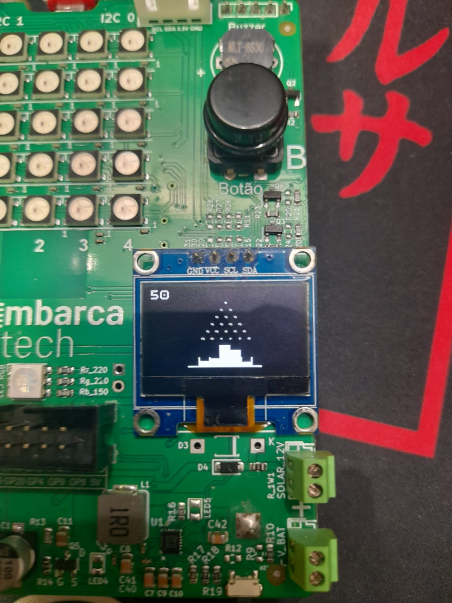

# Projeto: Simulação do Tabuleiro de Galton

  

**Autor:** Fabio Barbosa  
**Curso:** Residência Tecnológica em Sistemas Embarcados  
**Instituição:** EmbarcaTech - HBr  

---

## Introdução

Este projeto consiste em uma simulação do Tabuleiro de Galton utilizando a Raspberry Pi Pico W e um display OLED. A proposta é demonstrar, de forma visual e interativa, o comportamento estatístico da distribuição normal por meio da queda de bolas que colidem com pinos e se acumulam em canaletas inferiores.

A simulação foi implementada em C, aproveitando as bibliotecas do Pico SDK, e apresenta tanto movimentação das bolas quanto a contagem e exibição gráfica das distribuições resultantes. O objetivo principal é ilustrar como eventos binários aleatórios sucessivos podem gerar padrões previsíveis, refletindo princípios fundamentais da estatística.

---

##  O que você observou sobre o padrão dos resultados?

A simulação apresenta uma distribuição de bolas que tende a se concentrar nas canaletas centrais, formando um padrão semelhante a uma curva em forma de sino.  
Esse comportamento é característico de uma distribuição normal, onde a maioria dos valores se agrupa em torno da média, com menos ocorrências nas extremidades.

---

## A simulação confirma a teoria da distribuição normal?

Sim, a simulação confirma a teoria da distribuição normal.  
Conforme descrito na literatura, o Tabuleiro de Galton demonstra como eventos aleatórios binários (como a bola indo para a esquerda ou direita em cada pino) resultam em uma distribuição binomial que, com um número suficiente de interações, se aproxima de uma distribuição normal.  
Embora o número de linhas de pinos na simulação seja limitado, o padrão observado já reflete essa tendência.

---

##  Qual tipo de desbalanceamento você sugere em uma inclusão futura nesta simulação?

Para explorar diferentes cenários e enriquecer a simulação, poderiam ser considerados os seguintes desbalanceamentos:

- **Introduzir viés nos pinos**: Alterar a probabilidade de a bola ir para a esquerda ou direita (ex: 60% para a direita e 40% para a esquerda).
- **Modificar a posição inicial das bolas**: Lançar bolas de posições diferentes para analisar o impacto na distribuição.
- **Variar o espaçamento entre os pinos**: Alterar a distância entre os pinos para influenciar o caminho das bolas.

---

##  Você teve alguma ideia para tornar a simulação mais interativa ou visual?

Sim, aqui estão algumas sugestões para tornar a simulação mais envolvente:

- **Incluir animações suaves**: Movimentos mais naturais das bolas.
- **Implementar feedback sonoro**: Efeitos de som nos impactos dos pinos e quedas nas canaletas.

Essas melhorias tornariam a simulação mais interativa, visualmente atraente e educativa.
